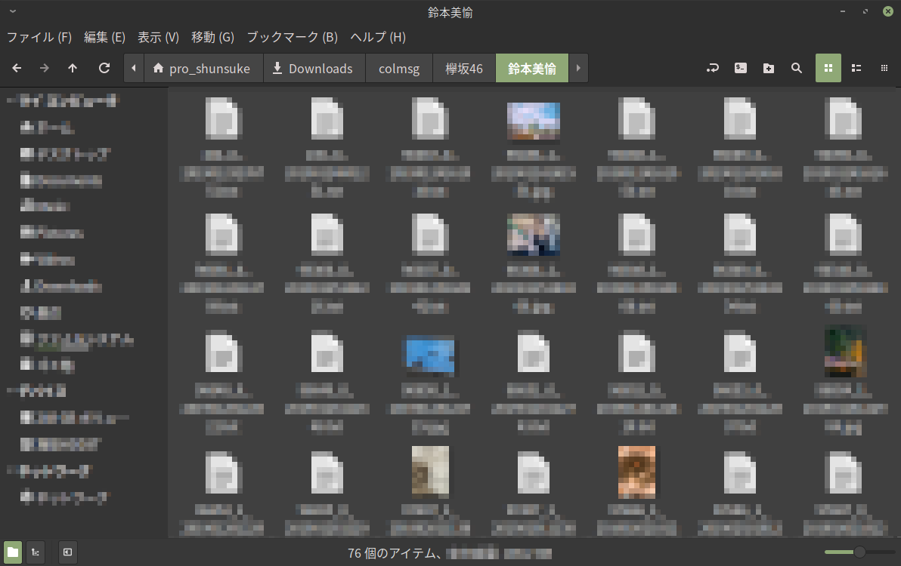

#  colmsg

「欅坂46/日向坂46 メッセージ」アプリのメッセージをPCに保存します。



## 概要

`colmsg` のインストール方法は[こちら](#インストール)を参照してください。

**まず初めに**「欅坂46/日向坂46 メッセージ」アプリのusernameとtokenを取得してください。
取得方法は[こちら](doc/how_to_get_username_token.md)を参照してください。

取得出来たら以下を実行してください。
`<username>` と `<token>` にそれぞれ取得してきたusernameとtokenを入れてください。  
購読しているメンバー全員の全期間のメッセージが保存されます。

```shell script
$ colmsg -u <username> -t <token>
```

## 特徴

* [x] 端末のroot化の必要がありません
* [x] Android, iosアプリどちらにも対応しています
* [x] Windows, macos, Linuxで実行できます
* [x] 様々な保存方法が選べます

## 使い方

概要で基本的な使い方を説明しました。しかし、usernameとtokenは機微情報なため、ターミナル上で直接入力するのはあまり良くないでしょう。
そこで、configファイルにデフォルトのオプションを設定しておくことをおすすめします。
configファイルについては[こちら](#configファイル)を参照してください。
以降はconfigファイルでusernameとtokenが設定されているものとします。

`colmsg` にはいくつかのオプションがあり、様々な保存方法を選べます。

特定のメンバーのメッセージを保存したい場合

```shell script
$ colmsg -n 菅井友香 -n 佐々木久美
```

特定のグループのメッセージを保存したい場合

```shell script
$ colmsg -g keyakizaka
```

特定の種類のメッセージを保存したい場合

```shell script
$ colmsg -k image -k movie
```

特定の日時以降のメッセージを保存したい場合

```shell script
$ colmsg -F '2020/01/01 00:00:00'
```

オプションは組み合わせて使用することが出来ます。より詳細な説明は以下を実行して確認してください。

```shell script
$ colmsg --help

colmsg 0.1.0
A CLI tool for saving messages of '欅坂/日向坂メッセージアプリ' locally.

USAGE:
    colmsg [FLAGS] [OPTIONS] --token <token> --username <username>

FLAGS:
        --delete
            delete all saved messages.
            if you execute command with this option, all saved messages are deleted from your disk.
            please use be careful.
    -h, --help
            Prints help information

    -V, --version
            Prints version information


OPTIONS:
    -d, --dir <dir>
            set a project directory.
            default directory is ~/Documents/colmsg.
    -F, --from <from>
            save messages after a specific date.
            date format is %Y/%m/%d %H:%M:%S
            e.g. -F '2020/01/01 00:00:00'
    -g, --group <group>
            save messages of specific group.
            if not specified, save messages both of groups [possible values: keyakizaka, hinatazaka]
    -k, --kind <kind>...
            save specific kind of messages.
            if not specified, save all kinds of messages.
            e.g. -k text -k image [possible values: text, image, movie, voice]
    -n, --name <name>...
            save messages of specific members (菅井友香,佐々木久美,..)
            name must be a valid full name of kanji.
            if not specified, save messages of all members.
            e.g. -n 菅井友香 -n 佐々木久美.
    -T, --to <to>
            save messages before a specific date.
            date format is %Y/%m/%d %H:%M:%S
            e.g. -T '2020/01/01 00:00:00'
    -t, --token <token>
            set a token. token is required.

    -u, --username <username>
            set a username. username is required.
```

## 詳細な仕様

* 既にいくつかメッセージが保存されている場合にコマンドを実行すると、最後に保存したメッセージ以降のメッセージを取得して保存します
* 保存されるメッセージは次のディレクトリ構造で保存されます
  * ```shell script
        .
        ├── 日向坂46
        │   └── 佐々木久美
        │       ├── 1_0_20191231235959.txt
        │       └── 2_1_20200101000000.jpg
        └── 欅坂46
            └── 菅井友香
                ├── 3_2_20200101000001.mp4
                └── 4_3_20200101000002.mp4
        
        ```
* ファイル名の形式は `<シーケンス番号>_<種類>_<日付>.<拡張子>` となっています
  * シーケンス番号はメッセージの時系列を表す番号になっています。若い数字程昔のメッセージです。ファイルブラウザでディレクトリを見る際に辞書順で並べると保存したメッセージが時系列通りに並びます
  * 種類の数字は以下のように対応しています
    * 0: テキストメッセージ
    * 1: 画像
    * 2: 動画
    * 3: ボイス
* 各環境毎のデフォルトの保存先は以下のようになっています
  * |Platform | Value                  | Example                  |
    | ------- | ---------------------- | ------------------------ |
    | Linux   | `XDG_DOWNLOAD_DIR`     | /home/alice/Downloads    |
    | macOS   | `$HOME`/Downloads      | /Users/Alice/Downloads   |
    | Windows | `{FOLDERID_Downloads}` | C:\Users\Alice\Downloads |
* 既に保存済のメッセージは上書き保存されません

## configファイル

`colmsg` は設定ファイルで予めオプションを指定することが出来ます。
各環境毎のオプションの保存先は以下のようになっています

|Platform | Value                                 | Example                                        |
| ------- | ------------------------------------- | ---------------------------------------------- |
| Linux   | `$XDG_CONFIG_HOME` or `$HOME`/.config | /home/alice/.config/colmsg/config              |
| macOS   | `$HOME`/Library/Preferences           | /Users/Alice/Library/Preferences/colmsg/config |
| Windows | `{FOLDERID_RoamingAppData}`           | C:\Users\Alice\AppData\Roaming/colmsg/config   |

### フォーマット

この設定ファイルはコマンドライン引数の単純なリストです。`colmsg --help` を利用すると、利用可能なオプションとその値を閲覧することが出来ます。さらに、`#` でコメント文を加えることができます。

設定ファイルの例:

```bash
# usernameを指定
-u username

# tokenを指定
-t token

# メディアファイルだけ保存するように設定
-k image -k movie -k voice
```

## インストール

### バイナリ

ビルド済の実行ファイルを以下からダウンロードしてください。

TODO: リリースページへ飛ばす

## 開発

`colmsg` は外部APIを叩きます。開発時はAPIのモックサーバを建てると良いでしょう。そのためのSwagger Specを配置してあります。
TODO: Swagger Specを置く

モックサーバのbase urlを環境変数 `BASE_URL` で指定することが出来ます。以下のように指定することでモックサーバ宛てにAPIを叩きにいきます。

```shell script
$ BASE_URL=http://127.0.0.1:3100 cargo run -- --help
```

## TODO

* [ ] deleteの実装
* [ ] docker環境の用意
* [ ] CIによる自動テスト
* [ ] usernameとtokenの詳しい取得方法
* [ ] examplesの用意
* [ ] バイナリファイルの用意
* [ ] windowsでの動作確認
* [ ] macosでの動作確認
* [ ] メッセージ保存処理の並列化
* [ ] api clientのcrate化
* [ ] swagger specの配置

## ライセンス

`colmsg` は MIT License の条件の下で配布されています。

ライセンスの詳細については [LICENSE](LICENSE.txt) ファイルを参照して下さい。

## 注意事項

アプリの利用規約 第8条（禁止事項）に以下の項目があるため注意してください。

* (16) 当社が指定するアクセス方法以外の手段で本サービスにアクセスし、またはアクセスを試みる行為
* (17) 自動化された手段（クローラおよび類似の技術を含む）を用いて本サービスにアクセスし、またはアクセスを試みる行為 
