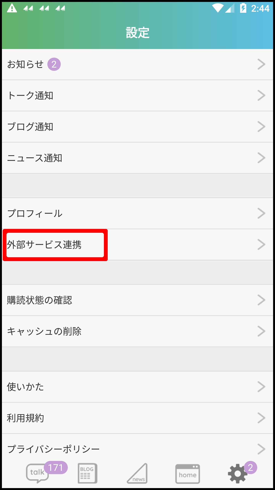
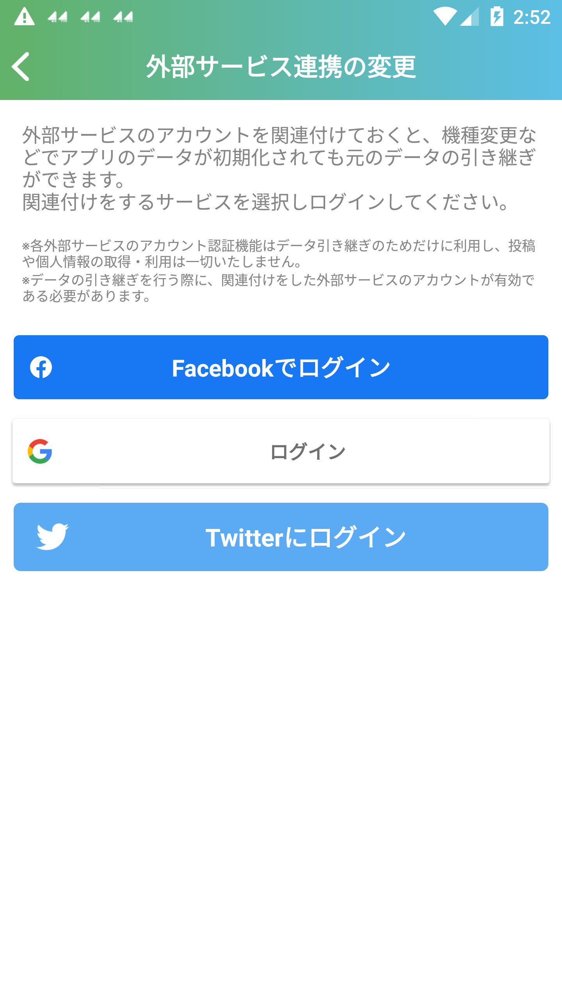

# refresh_tokenの取得方法

## はじめに

以下で説明する方法によってデータ損失等が発生する可能性があります。自己責任でお願いします

## 外部サービス連携

**必ず**外部サービス連携をしてください。外部サービス連携をしないとデータが失われる可能性があります。  
失われなかった場合でもデータ復旧のためにアプリ開発会社への問い合わせを行う必要があり、これには時間がかかる可能性があります。

[mitmproxy](https://mitmproxy.org/)を使用して通信内容からusernameとtokenを取得してください。

Android 7 以降ではmitmproxyが動作しないため、[Genymotion](https://www.genymotion.com/)などのエミュレータを使用し、Android 6 以前の環境を作ってusernameとtokenを取得してください。
